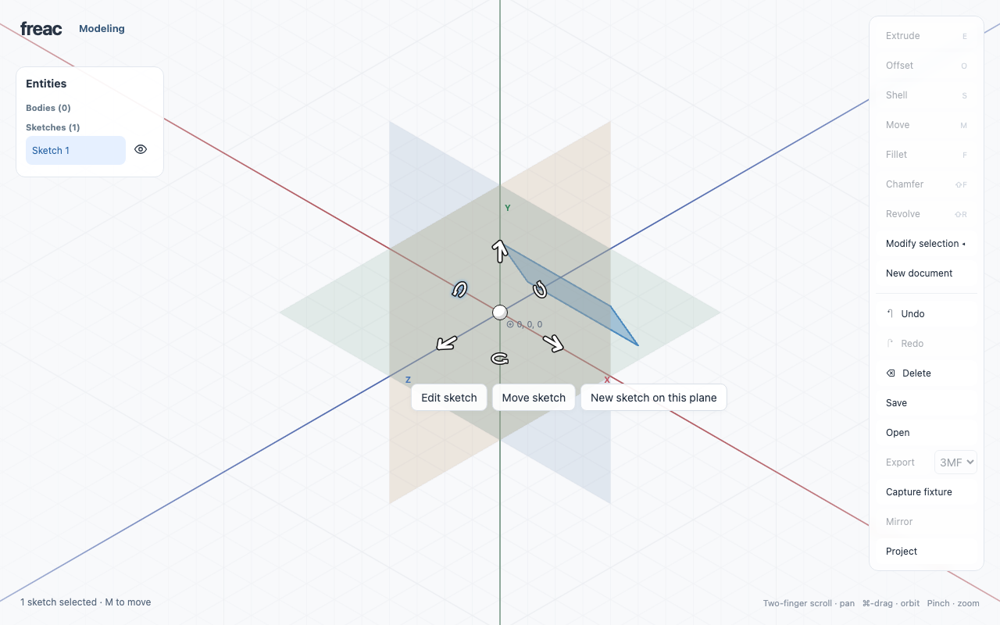

# Orientable widgets — rough design language

The founder approved the refined Move widget on 2026-09-21 as the visual reference
for other orientable controls. Use this guide when giving another tool the same
treatment. It records the shared direction; each tool still needs its own interaction
design. The reference implementation is commit `07fa2d1`.

## The visual idea

A widget is a small, readable object attached to geometry. Its shape and orientation
explain the action. Use white fill, a near-black silhouette and rounded solid forms.
Keep the surrounding model, axes and faint grids visible. Spatial handles should
read directly as arrows, rings or anchors without a labeled rectangular button
around each glyph. Ordinary value inputs and accept/cancel controls can stay nearby.

- Build slender arrows from cylinders with spherical caps: capsules. Round joins
  should merge into a single silhouette, with no internal seams or doubled outlines.
- Prefer simple geometry and a few clear contours. Avoid outlining triangulation,
  extrusion cap edges or every visible surface. This is a toon treatment, not wireframe.
- Use a sphere for a movable anchor. A small amount of neutral shading can make its
  volume clear; the reference sphere has a white face and light-gray lower edge.
- Keep secondary glyphs smaller. The current rotation marker is a 270° curved shaft
  with a rounded tail and a filled triangular arrowhead. Its shape came from the
  founder's fixture sketch, not from the fixture's invalid body mesh.
- Preserve the white/black base treatment across axes. Subtle blue feedback identifies
  hover or snapping; invalid geometry may use red. Color supplements shape and state.

## Orientation, scale and visibility

Treat the assembly as a rigid object in its chosen frame. The tool decides whether
that frame is the sketch plane, world axes, or a meaningful frame on selected geometry.
Keep each glyph's position and meaningful axes fixed in that frame during camera orbit.
An intentional tool or selection change can establish a new frame.

**Founder refinement, 2026-09-21:** a tool may roll its whole glyph around an
operation axis when that roll has no geometric meaning. Move translation arrows
(body, face, edge and sketch; clarified 2026-09-23), Extrude, Offset and Shell use the perpendicular direction that faces the camera, preserving the actual edit
axis and the fixed anchor/marker position. Exactly end-on uses camera right as its
otherwise undefined roll. Move arrows roll around their shafts as the camera moves;
the shaft direction, placement and rotation-marker planes retain their geometric frame.
This is not permission to redirect meaningful axes toward the camera. Offset can
still be ambiguous directly along its normal; this first pass does not add a different end-on symbol.

**Offset follow-up, 2026-09-21:** use two separated curved surface contours instead
of overlapping rectangular outlines. On cylindrical faces, choose a visible surface
point whose radial normal projects mostly across the screen, rather than the nearest
point facing the camera. Retain that point until a candidate improves the placement
score by 0.18; the score favors a normal/view dot product of 0.35 and decreases
continuously toward back-facing normals. Candidate points come from display triangles
projected onto the analytic cylinder, including inward walls. This view-only memory
resets with changed face geometry. Freeze placement for the entire active edit so dragging never changes
its axis. This is an explicit exception to fixed idle anchor placement, not permission
to redirect a planar face's normal. Exact end-on planar Offset remains foreshortened.

Fillet and Chamfer have a meaningful section orientation: use the normal section
at the closest point on the selected edge to the widget anchor, perpendicular to
that edge's local tangent. Circular edges use their analytic tangent; other curves
use their nearest displayed segment. Existing fillet-face resizing uses the nearest
boundary's section. Do not substitute an arbitrary world perpendicular for this
geometry-defined frame or independently turn the contour toward the camera.

Project the assembly through the viewport camera. Roll a direction-only arrow as a
whole around its shaft; do not independently turn its head
toward the camera, slide markers to avoid collisions, or switch a marker to another
diagonal as the camera moves. Those adjustments caused the rejected drifting effect.
Foreshortening is expected. Exact diagonal views can make handles overlap; orbiting
reveals them again. A future overlap treatment must preserve the rigid placement.

Keep the widget's nominal size and outline weight constant in CSS pixels when zooming.
A glyph still foreshortens along its meaningful axes; direction-only arrow widths
remain camera-facing. Move uses the viewport's orthographic camera and converts its
pixel offsets to world units with `world.height / canvas.clientHeight`.

Hide a planar rotation marker when its plane becomes nearly edge-on. Hiding must
also remove its hit target. Do not leave a thin, ambiguous sliver or an invisible
rotation control. In the current implementation, with unit view direction `d` and
rotation-plane normal `n`, hide when `abs(dot(d, n)) <= sin(12°)`.

Move also uses a simpler 2D assembly in sketch mode and when a canonical axis is
within 12° of pointing toward or away from the camera. It then shows the other two
translation axes and rotation about the end-on axis. A 3D view otherwise shows three
translation axes and up to three rotation markers, subject to edge-on hiding.
These are Move's rules, not a requirement to add three axes to every tool.

## Reference proportions

These are current defaults to start from, not immutable dimensions for all widgets.
Keep the hierarchy and visual weight consistent when adapting them.

| Element | Move reference |
| --- | --- |
| Fill / outline | `#fff` / `#151515` |
| Visible outline thickness | About 1.5 CSS px |
| Glyph viewport | 48 × 48 CSS px |
| Translation shaft | 4 px diameter; 28 px centerline length |
| Translation marker position | 96 px along the positive axis before projection |
| Rotation marker position | 72 px along each of its two plane axes; a fixed 45° diagonal |
| Rotation shape scale | 0.65 of its source profile |
| Anchor sphere | 20 px diameter |
| Modeling hit regions | 48 px translation, 30 px rotation; separate from glyph shape |
| Camera tolerances | 12° for Move's axis alignment and rotation edge-on hiding |

These hit-region sizes have desktop runtime coverage, not physical iPad acceptance.
Do not confuse a glyph's SVG viewport, its visible silhouette and its pointer target.

## Interaction follows the geometry

Dragging a directional handle should follow its projected axis; dragging a rotation
handle should measure rotation in its plane. Keep numeric entry available where the
tool supports it. Supply meaningful accessible names and tooltips even when the visible
handle has no text. Hover is feedback, not selection or a document edit.

Preserve the tool's existing preview, acceptance, cancellation and Undo contract when
changing its appearance. This guide does not make every tool commit on drag release:
Move and extrusion have different completion rules. Keep accepted geometry, gesture
preview and widget UI state separate. A redesigned handle must remain usable after
reselection and when returning to an existing document.

For Move specifically, dragging the sphere changes only the anchor, not geometry or
Undo. It uses the sketch/visible plane in 2D, or the plane through the anchor normal to
the upright canonical axis in 3D (Y-up means XZ). Visible points of interest take
precedence under the cursor; Command gives free placement. See the
[transform contract](../architecture/transforms.md#move-widget-founder-directed-2026-09-21)
for snapping, occlusion and cancellation details. Other tools should adopt an anchor
only when it has a clear meaning for their operation.

## Implementation references

The shared style does not require a new rendering framework or a kernel-built mesh.
The current orthographic implementation projects capsule centerlines into SVG. Round
strokes are the projected capsule silhouettes: paint all dark outer silhouettes, then
all white interiors, so joined parts have no internal outlines. A different renderer
is fine if it preserves the same visual and spatial behavior.

- [Glyph construction](../../src/sketch/move-widget/marker.ts): capsule arrow and
  fixture-derived curved arrow, combined outlines and fills.
- [Camera rules and dimensions](../../src/sketch/move-widget/geometry.ts): reference
  planes, alignment, edge-on visibility and upright-axis selection.
- [Axial roll](../../src/model/widget-frame.ts): camera-facing width around an unchanged shaft.
- [Modeling assembly](../../src/model/body-gizmo.ts) and
  [styles](../../src/model/body-gizmo.css): world projection, buttons, sphere and state.
- [Sketch overlay](../../src/sketch/transform-overlay.ts),
  [handle positions](../../src/sketch/transform-handles.ts) and
  [picking](../../src/sketch/picking.ts): keep rendering and hit testing in agreement.
- [Anchor drag](../../src/model/body-pivot-drag.ts) and
  [whole-sketch placement](../../src/sketch/placement-controls.ts): UI-only anchor
  versus an operation that transforms the sketch's plane.
- [Camera/model tests](../../tests/move-widget.test.ts) and
  [real-control acceptance runner](../../tests/move-widget-ui.mjs).

The extra boundary-normal edge-movement handle retains a specialized end-on fallback;
it is an existing tool-specific exception, not a general layout recipe.

## Applying this to another tool

### Tool adaptations (2026-09-21; founder approved, including Offset follow-up)

The founder clarified that the common language must preserve each tool's visual
meaning, not replace everything with arrows. Fillet uses a rounded corner contour,
Chamfer a beveled corner, Extrude a lifted circular profile, Offset separated surface
outlines, and Shell a hollow wall section. A small capsule arrow accompanies each
form to explain the positive drag direction. Existing blend resize uses Fillet's
form. Sketch Offset shows the same separated contours in its sketch plane.

Solid controls use the operation axis with the roll rules above;
sketch Offset uses its curve normal and perpendicular in the sketch plane. The
64 × 64 CSS-pixel glyph/target sits 48 CSS-pixel world units along the edit direction
and 32 along its perpendicular before projection. This fixed transverse offset
keeps an end-on handle clear of the geometry selection click. Fillet/Chamfer retain
their last-picked edge anchor and distinct mode buttons; Extrude/face Offset follow
the temporary displaced surface. No movable anchor is added.

These forms retain their operation axis and foreshorten along it. Numeric access remains available;
the existing axial up/down fallback remains on Extrude/Offset/Shell when end-on.
Edge-finish size is typed until orbit reveals a direction. Blue hover and red
invalid/limit feedback supplement the white/black contours.

Revolve retains a curved rotation symbol at the swept profile center and uses a
capsule for axial height, 80 CSS-pixel world units along its axis and 32 across it.
Spatial handles are not clamped to viewport edges. The rotation glyph and hit
target hide within 12° of edge-on; the angle field remains available. Standalone
sketch rotation uses the same curved glyph and visibility rule with matching picking.

Sketch Fillet's corner arc, Bow's curve guides, and point/resize/tangent handles
already describe editable geometry rather than floating direction icons. They
retain their geometry-based interactions. Mirror, Boolean, projection and
constraint cards are ordinary commands/fields, not orientable spatial glyphs.

Identify every entry point for that operation before replacing its UI. The initial
Move pass missed the separate **Move sketch** placement controller. Reuse the glyph
projection and style where they fit, while keeping operation-specific behavior explicit.

Review a front view, an oblique view and a near-edge-on view; orbit continuously to
catch drift, then zoom to check scale and line weight. Check white/light backgrounds
and selected geometry behind the glyph. Verify the visible hit targets through real
pointer/keyboard input, typed values, cancellation, Undo/Redo and reselection. Test
Chromium, WebKit and hidden Electron as appropriate; record device gaps accurately.

Bring the result back for visual review. The founder's approval of Move establishes
a direction for new work, not blanket acceptance of other tools or new semantics.
